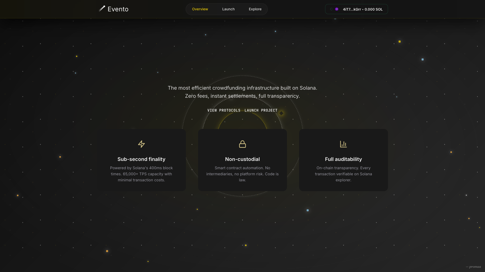

# 🚀 Live Demo

The site is currently available at: [https://promaaa.github.io/Evento/#](https://promaaa.github.io/Evento/#)

# Evento



Evento is a ticketing and crowdfunding dApp for the **Solana** blockchain that runs entirely as a static site. It includes a minimal in-memory API and an optional MongoDB-backed backend.

## Features
- Create events with configurable ticket tiers and track funds raised.
- Purchase tickets through direct SOL transfers using a Phantom wallet.
- Works as a static site with optional server-side verification.

## Prerequisites
- Node.js 18+
- Phantom wallet with SOL.

## Quick Start
1. Install dependencies:
   ```sh
   npm install
   ```
2. Run the local server:
   ```sh
   npm start
   ```
3. Open [http://localhost:3000](http://localhost:3000)

## Configuring the API URL
If you host the API elsewhere (Render, Railway, etc.):
1. Create `config.js` at the project root with:
   ```js
   window.API_BASE = "https://your-backend.example";
   ```
2. Reference `config.js` in `index.html` before the main script tag.

## Network Configuration
Devnet is the default network:
```js
const SOLANA_NETWORK = "https://api.devnet.solana.com";
```
Change this value in `index.html` to point to a custom RPC or mainnet.

## Customizing Events
- Static mode: edit the `defaultEvents` array in `index.html`.
- Node server: edit the `events` array in `server.js`.

## Full API with MongoDB
A richer API that persists events and contributions lives under [`backend/`](backend/). See the README in that directory for setup and environment variables (`MONGO_URI`, `SOLANA_SECRET_KEY`).

## Project Structure
```
.
├── index.html          # Web interface
├── server.js           # Minimal API (Express + in-memory storage)
├── package.json
├── backend/            # Full API with MongoDB
├── docs/               # Additional documentation
│   └── picture/
│       └── screenshot.png
└── ...
```

## License
Distributed under the ISC License. See [LICENSE](LICENSE) for details.
